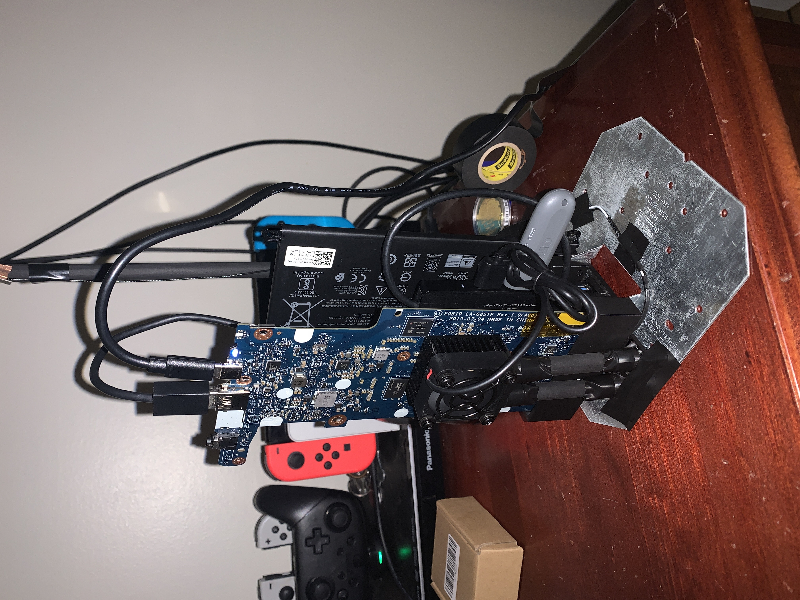

__NOTE: While I do go in depth about how I built this, this is not a build guide.__

Ever since I was little, I have always wanted my own homelab. I didn't know what they are or how to build one, or even what they actually did, I just knew I wanted one. But, my kid self had 10 bucks and a pack of skittles, so I wasn't getting my dream anytime soon. That's why I was so excited to work on a server that younger me could actually afford.

# What is Cerium

Cerium is a Chromebook that has been modded so that it can act as a Debian-based server. Some of these changes include a new BIOS via Mr. Chromebox, a bare-bones Debian install, removal of all unnecessary parts, a custom made stand, and a USB powered heat sink. It is just powerful enough to run basically any minor task you throw at it. Its main goal is to be able to prove that servers can be built for extremely low cost.

# The Parts

To make Cerium, I used the following parts (Tools not included):

  - A Dell Chromebook 3100 with an Intel Celeron N4020 (More specs later)

  - A 10$ heat sink with a fan I got off of Amazon

  - A 128GB flash drive I got from Walmart

  - A USB-C charger from my school Chromebook

  - An H10A hurricane tie rescued from a dumpster

  - 3/8" wide, 3ft long dowel

  - Matte Black Paint

  - Black PLA 3D printing filament

  - A USB hub

  - EVA Foam

  - Black Electrical Tape

The total price (When dividing the Chromebook's price by two because there were two in the lot) was around 45$.

# Performance

Temps: `63°C` under load for one minute, `67°C` for fifthteen.

Wi-Fi: `300 Mbps` down / `80 Mbps` up

# The Chromebook

The Chromebook's specs are:

  - Intel Celeron N4020 (1.1 GHz)

  - 16GB eMMC Storage

  - 4GB RAM

  - 11.6-inch HD Screen

To get it, I found a lot of 2x on eBay for 35$ or just under 18$ a computer.

# Namesake

The name for this project comes from the element Cerium, which is the most abundant rare earth metal. I would consider servers quite scarce and expensive, much like rare earth metals, but Cerium, with it's price and quick setup, could be extremely common, like its namesake.

# The Process

To make Cerium capable of being a server, there were many steps.

## Installing Custom Bios

The first major problem is that because of Google's lockdown ecosystem, a Chromebook can't boot OSes like Windows or Linux, just verified versions of ChromeOS. To get around this, I, like many others, used the Mr. Chromebox firmware. To do this, I had to enable Developer Mode on the Chromebook, unplug the battery while flashing the firmware (This acts as modern Chromebook's write protect screw), and then run the Mr. Chromebox utility script through the command:

```shell
cd; curl -LO mrchromebox.tech/firmware-util.sh && sudo bash firmware-util.sh
```

This script flashed the new custom ROM and BIOS and allowed the Chromebook to boot the OS I would be using, Debian.

## Installing Debian

Because the Chromebook only had around 16GB of memory, I decided to go with a completely text-based Debian install. While Debian is known as a great server OS because of it's extreme stability and huge package ecosystem, I used it because of it's small size without a GUI. I went through the install like normal, making sure to install my commonly used packages and more firewalls and security measures than I usually use (ufw, fail2ban, SSH key authentication, etc). I also disabled sleep and power-saving features so it can run 24/7.

## Setting Up SSH

I wanted this Chromebook to be completely headless, so I had to set up SSH. I gave the Chromebook a static IP on my router, then also set up an SSH alias, so all I had to type is `ssh cerium`. But, because each time I had to login, it sent my password over the open internet for verification, I set up a passphrase that I only have to sign in with once per session on my main computer. After I remove the motherboard from the shell, this will be my only way to control the machine.

## Stripping the Chromebook

Because I wanted this to be small, power efficient, completely headless, and look cool, I decided to pull out the motherboard of the Chromebook, as well the battery and the Wi-Fi antenna. While the motherboard (Which has the CPU, RAM, Wi-Fi card, and eMMC storage directly on it) and battery were easy to take out, the Wi-Fi antenna was located in the bezel of the screen, which required most of the laptop to be disassembled. Luckily, everything went smoothly and I was able to get it out pretty quickly. (Also in this process the port for the screen on the motherboard broke so it is completely headless permanently.) I kept the battery so it could act as a temporary UPS so if the power went out it would continue on the battery even if it is super degraded.

# Making the Stand

The stand was a project in of itself, but luckily I didn't break any parts in my fits of rage. For any of the cad, you can find it right here:
[Download Cad](cad.zip)

## The Stand Base

For the base, I used an H10A hurricane tie, which I hammered the slightly folded edge straight, as well as turning the flaps slightly in on each other so the if the battery and motherboard did fall, it would fall onto it. Then, I took the sticker off and cleaned the entire stand to get rid of any dirt and junk on it.

## The Vertical Part holders

To keep the battery and motherboard standing up, I used an almost bucket like design. While the battery could touch the PLA directly, the motherboard couldn't, so I made a sock like design out of EVA foam and electrical tape for the bottom 3cm of it. This cushioned the motherboard so that if it wiggled, it wouldn't break. Unfortunately, because it wasn't ESD foam, it could cause a zap of static electricity, but because it doesn't move that often and just sits on my desk, I didn't think this was that important.(I did attempt to find ESD foam, but nobody in my town sells it so I pulled out the EVA foam in my closet) I also put a hole at the bottom of the motherboard's holder so the Wi-Fi cables could get through.

## Middle Part Hub Holder

Each of the vertical part holders had pins that went through the nail holes of the hurricane tie, and in the center of the 4cm gap, I put a middle piece that locked together the pins and held a USB hub that could be connected to the motherboard's USB port.

## Assembling the Base and Holders

To get together the holders, I had to first route the Wi-Fi cable through the motherboard's holder hole, which proved a challenge with the solid PCB located at the antenna's ends. After this, I was able to place the battery and motherboard into their respective slots, connect the power to the motherboard, and add the USB hub cable to the motherboard's USB port. But, during this process, the Wi-Fi cable had gotten loose, so I disassembled the entire thing again, hot glued and taped the cables down, and put it back together.

## Making the Wi-Fi Antenna

To make the Wi-Fi antenna, I measured how far the cable could reach and cut the dowel down to that size. Then I painted the dowel matte black, cut a triangle shape holder for it, taped the holder and dowel together, and wrapped the Wi-Fi cable around it.

## Fan Cooler

I first cut two 8cm dowels and painted them black. This acted as supports for the fan. Then I made two brackets to connect the dowels, and taped them together. Next, I taped them together at the joints. Finally, I placed the fan on the CPU and supported it with the bracket. To power the fan, I plugged its USB cable directly into the motherboard hub.

# The Software

To benchmark it I installed a Minecraft Bedrock server on the 128GB flash drive. I formatted the drive to ext4 to help with the constant little changes and then just cloned Mojang's built in server client using 

```shell
sudo wget https://www.minecraft.net/bedrockdedicatedserver/bin-linux/bedrock-server-1.26.11.1.zip
```

From there I unzipped and ran it where it worked just fine. There was occasional lag spikes, but I assume that was because my client device was my iPhone XR running vibrant visuals with battery saver on so do with that information what you wish.

# Conclusion

Cerium's main goal was to be built as cheap as possible, and it acomplished that. Total with the stand was about 50 bucks. That is pretty cheap for something that looks so good. It has decent performance and draws very little power. Plus I now have a conversation starter setting on my desk. Cerium accomplishes everything I set out to do and more, and that is pretty darn cool.

__Let's See What You Can Make!__

